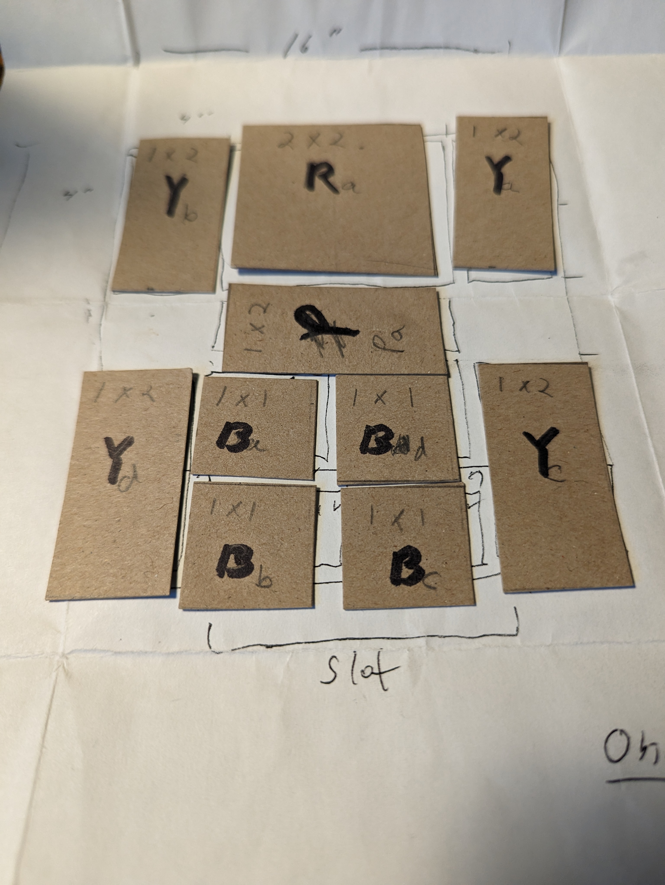
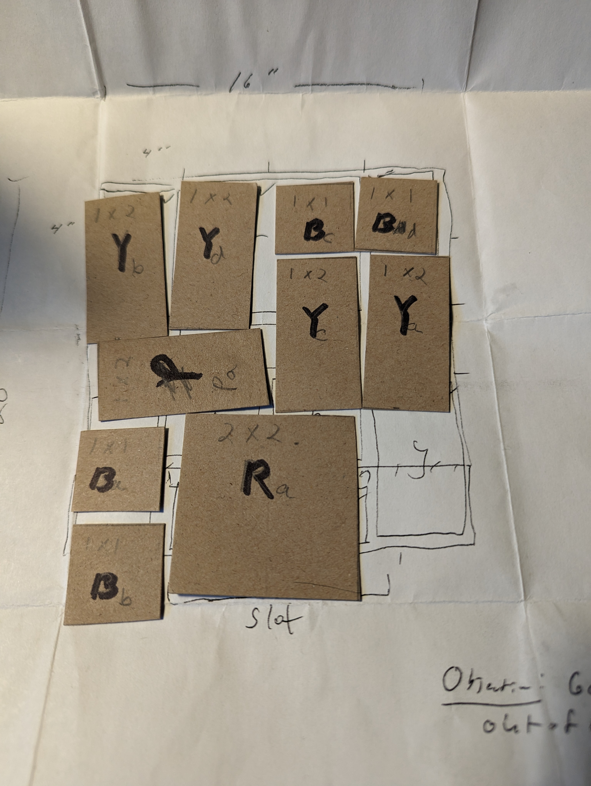

# Khun_Phaen_puzzle
## A solver for the Khun Phaen / Prisoner / Escape / Sunset puzzle

The Khun Phaen puzzle, also known as Prisoner, Escape, Sunset, and maybe others, requires moving the prisoner
(Khun Phaen) block past the 9 guards who are there to prevent him from escaping the 4x5 prison.
Khun Phaen is a poem-story famous in Thailand - see
[the Wikipedia article](https://en.wikipedia.org/wiki/Khun_Chang_Khun_Phaen).

This code prints a set of moves to get the big (red, 2x2) block from a given starting position to the escape position
where it is positioned at the exit slot. The starting position is arbitrary and can easily be changed

## Starting Position

## Goal Position

## Piece Colors
- R(ed), 2x2, the piece to be moved to the exit
- P(urple), 2x1, the wide short piece
- Y(ellow), 1x2, the skinny tall pieces
- B(lue), 1x1, the unit-size square pieces

## Running
Run the program by executing Khun_Phaen_driver.py. The program prints a list of moves
to solve the puzzle. See the file 120moveSolution.txt for the moves from start to goal.
Simple changes to the program can cause it to print other (longer) solutions, or solutions
from different starting BoardStates.

Different start states can be configured by defining new start_keys in Khun_Phaen_driver.py.

## Operation
A BoardState is a specific unique configuration of the board. It is
represented by a 20-character key. The
20 characters are the xy positions of the pieces R, P, Y1, Y2, Y3, Y4, B1, B2, B3, B4 in order.

The program sets up a simulation of the board, then asks each piece to report what moves are
available to it, given the current BoardState. Each move resulting in a new BoardState is
a new vertex on a graph, and the move represents an edge on the undirected graph connecting
the previous to the new BoardState.

The classes and their responsibiities are:
- Piece: base class of the class for each piece. It provides common functions needed by all
pieces, such as storage for the x-y position, and get/set position methods
- TxTPiece, TxOPiece, OxTPiece, OxOPiece: The specializations of each piece (TxTPiece: Two-by-Two,
Red, TxOPiece: Two-by-one, Purple, OxTPiece: One-by-two, yellow, OxOPiece: One-by-one, blue).
One Red, one Purple, 4 Yellow, and 4 Blue instances of these classes are created at startup.
The subclasses provide specialized behavior to each piece type, such as reporting what moves
that object can make given the current board configuration.
- BoardState: methods for operating on the board as a whole, such as discovering allowed moves,
and swizzling.
- GraphHandler: provide a method: create_graph() which explores the possible moves from
each discovered BoardState, and the method bfs_sp() which traverses the graph in a breadth-first
manner in search of shortest path to the goal BoardState.
- main() in Khun_Phaen_driver.py instantiates GraphHandler, which instantiates the BoardState
object and the pieces. It then repeatedly calls create_graph() method of GraphHandler to
discover the graph that connects the BoardStates (vertices) with moves (edges). When the
graph is fully explored (no more moves can be made which result in undiscovered BoardStates)
it calls bfs_sp() to find the shortest path from start to goal.

### Combinatorics and swizzling
The initial, naiive implementation searched all permutations of all pieces, treating the 24
variations on placement of each of Blue and Yellow as unique. This implementation took 45 minutes
to explore one million board states, and still hadn't found any where Red moved below row 2. The
combinatorics exploded exponentially, and the graph quickly became much larger than I'd expected.
Some optimization was needed.

It is obvious that if you swap two blue's, the resulting board state is
equivalent in terms of the moves available from the two board states. In
fact, there are 24 permutations of Blue pieces, and 24 of yellow, and
they can be treated as aliases of one another. The optimization was to
"swizzle" the Blues and Yellows to an alias where B1 is lower or left of
B2, B2 is lower or left of B3, and so forth.
Then the possible moves were evaluated from the swizzled
positions. This optimization resulted in finding the first solution
after only 15,000 board states had been explored.

## Puzzle Data
- The puzzle has 25954 unique BoardStates
- There are 964 unique paths from the standard starting position to the goal. The shortest path
from the standard starting position to the goal takes 119 or 120 moves. A move is defined
as moving one piece by one square. Some moves are "pairs" in that they move a piece two
spaces - if you're counting double-moves as one, there would be about 80 moves.

## Bugs
- The solver fails to print one of the required moves. The file 120moveSolution.txt
documents where the missing step is. It's pretty obvious: the steps tell you to move
a yellow to a space where there's already a yellow, and you have to move that yellow left.
